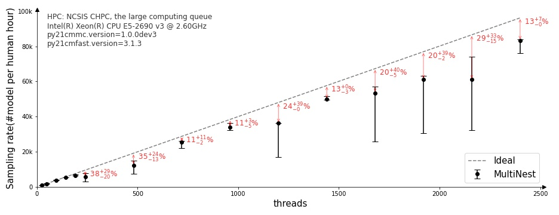

======
21CMMC
======

.. start-badges
.. image:: https://travis-ci.org/21cmFAST/21CMMC.svg
    :target: https://travis-ci.org/21cmFAST/21CMMC
.. image:: https://coveralls.io/repos/github/21cmfast/21CMMC/badge.svg?branch=master
    :target: https://coveralls.io/github/21cmfast/21CMMC?branch=master
.. image:: https://img.shields.io/badge/code%20style-black-000000.svg
    :target: https://github.com/ambv/black
.. image:: https://readthedocs.org/projects/21cmmc/badge/?version=latest
    :target: https://21cmmc.readthedocs.io/en/latest/?badge=latest
    :alt: Documentation Status
.. end-badges

An extensible MCMC framework for 21cmFAST.

This code uses `semantic versioning <https://semver.org>`_, though this will strictly
begin when `v1.0.0` is officially shipped.

* Free software: MIT license

Features
========

* Seamless integration with ``emcee``-based MCMC.
* Supports the ``MultiNest`` sampler.
* MCMC is easily extensible via the addition of different likelihoods using the same underlying data.

Scalability
===========

see more `here <https://github.com/21cmfast/21CMMC/issues/50/>`_.

Documentation
=============

See https://21CMMC.readthedocs.org.

Acknowledging
=============
If you find `21CMMC` useful in your research please cite at least one of the following
(whichever is most suitable to you):

    Bradley Greig and Andrei Mesinger, "21CMMC: an MCMC analysis tool enabling
    astrophysical parameter studies of the cosmic 21 cm signal", Monthly Notices of the
    Royal Astronomical Society, Volume 449, Issue 4, p.4246-4263 (2015),
    https://doi.org/10.1093/mnras/stv571

    Bradley Greig and Andrei Mesinger, "Simultaneously constraining the astrophysics of
    reionization and the epoch of heating with 21CMMC", Monthly Notices of the Royal
    Astronomical Society, Volume 472, Issue 3, p.2651-2669 (2017),
    https://doi.org/10.1093/mnras/stx2118

    Bradley Greig and Andrei Mesinger, "21CMMC with a 3D light-cone: the impact of the
    co-evolution approximation on the astrophysics of reionization and cosmic dawn",
    Monthly Notices of the Royal Astronomical Society, Volume 477, Issue 3, p.3217-3229
    (2018), https://doi.org/10.1093/mnras/sty796

    Jaehong Park et al.,  "Inferring the astrophysics of reionization and cosmic dawn
    from galaxy luminosity functions and the 21-cm signal", Monthly Notices of the
    Royal Astronomical Society, Volume 484, Issue 1, p.933-949 (2018),
    https://doi.org/10.1093/mnras/stz032
